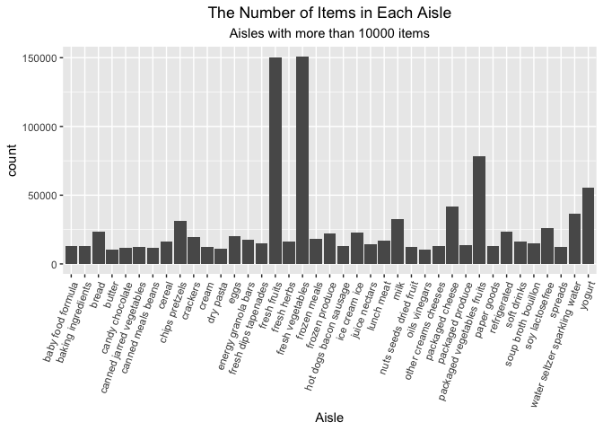
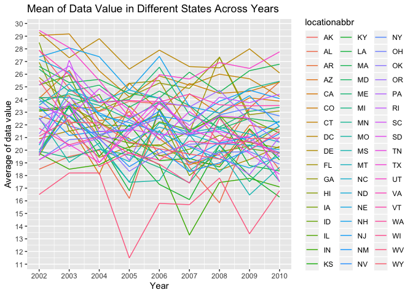
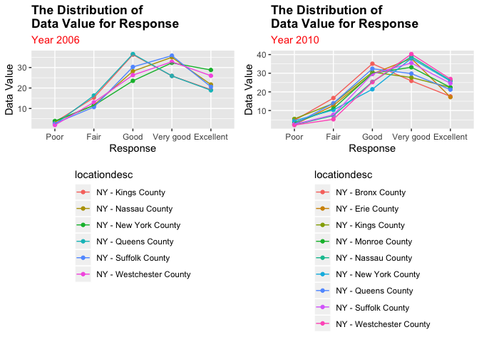
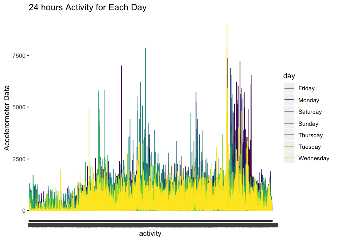

p8105\_hw3\_ss5929
================
Shuyi SHEN
10/4/2019

## Problem 1

``` r
library(p8105.datasets)
library(tidyverse)
```

    ## ── Attaching packages ───────────────────────────────────────────────────── tidyverse 1.2.1 ──

    ## ✔ ggplot2 3.2.1     ✔ purrr   0.3.2
    ## ✔ tibble  2.1.3     ✔ dplyr   0.8.3
    ## ✔ tidyr   1.0.0     ✔ stringr 1.4.0
    ## ✔ readr   1.3.1     ✔ forcats 0.4.0

    ## ── Conflicts ──────────────────────────────────────────────────────── tidyverse_conflicts() ──
    ## ✖ dplyr::filter() masks stats::filter()
    ## ✖ dplyr::lag()    masks stats::lag()

``` r
library(dplyr)
library(ggplot2)
library(kableExtra)
```

    ## 
    ## Attaching package: 'kableExtra'

    ## The following object is masked from 'package:dplyr':
    ## 
    ##     group_rows

``` r
library(patchwork)
library(ggpubr)
```

    ## Loading required package: magrittr

    ## 
    ## Attaching package: 'magrittr'

    ## The following object is masked from 'package:purrr':
    ## 
    ##     set_names

    ## The following object is masked from 'package:tidyr':
    ## 
    ##     extract

``` r
data("instacart")
max(instacart$aisle_id)
```

    ## [1] 134

``` r
# count the items in each aisle
aisle_count<-instacart %>% 
  group_by(aisle_id,aisle) %>% 
  dplyr::summarise(n=dplyr::n()) 

#filter the aisle with most counts  
aisle_most<-aisle_count %>% 
            filter(n==max(aisle_count$n))
```

**Summary**

*instacart*

There are 1384617 obeservations and 15 variables in the `instacart`
dataset. The variables include:

`order_id`: order identifier

`product_id`: product identifier

`add_to_cart_order`: order in which each product was added to cart

`reordered`: 1 if this prodcut has been ordered by this user in the
past, 0 otherwise

`user_id`: customer identifier

`eval_set`: which evaluation set this order belongs in

`order_number`: the order sequence number for this user

`order_dow`: the day of the week on which the order was placed

`order_hour_of_day`: the hour of the day on which the order was placed

`days_since_prior_order`: days since the last order

`product_name`: name of the product

`aisle_id`: aisle identifier

`department_id`: department identifier

`aisle`: the name of the aisle

`department`: the name of the department

For example, in the first line, the user 112108 order the Bulgarian
Yogurt in te yogurt aisle in dairy department. Its aisle id is 120,
department id is 16 and product\_id is 49302. The order is placed at 10
on Thursday, it has been reordered before and it is the first product
added in the cart.

From my point of view, the key variables are `reordered`, `order_number,
order_dow, order_hour_of_day, days_since_prior_order, product_name`,
`aisle, department`

There are `134` aisles and `fresh vegetables` is the aisle that most
items ordered from.

``` r
# the plot
aisle_count %>% 
  filter(n>10000) %>%
  ggplot(aes(x=aisle,y=n))+
  geom_bar(stat = "identity")+
  labs(
    title="The Number of Items in Each Aisle",
    subtitle = "Aisles with more than 10000 items",
    x="Aisle",
    y="count"
  )+
  theme(plot.title = element_text(hjust=0.5))+
  theme(plot.subtitle = element_text(hjust=0.5))+
  theme(axis.text.x = element_text(angle=70, hjust=1))+
  viridis::scale_color_viridis(discrete = TRUE)
```

<!-- -->
**Summary**

*plot*

In the plot, the x-axis is `aisle` with more than 10000 items and y-axis
is the number of items in each aisle. In the plot, we can see in the
`fresh fruits` aisle and `fresh vegetables` aisle have obviously more
items ordered than other aisles.

``` r
# choose three most popular items in each aisle respectively
baking<-instacart %>% 
  filter(aisle=="baking ingredients") %>% 
  select(product_name,aisle) %>%    
  group_by(product_name) %>% 
  dplyr::summarise(n=dplyr::n()) %>% 
  arrange(.,desc(n)) %>% 
  top_n(.,3) %>%  
  plyr::rename(.,c(product_name="baking ingredients")) 
```

    ## Selecting by n

``` r
dog_food<-instacart %>% 
  filter(aisle=="dog food care") %>% 
  select(product_name,aisle) %>%    
  group_by(product_name) %>% 
  dplyr::summarise(n=dplyr::n()) %>% 
  arrange(.,desc(n)) %>% 
  top_n(.,3) %>%  
  plyr::rename(.,c(product_name="dog food care"))
```

    ## Selecting by n

``` r
packaged_vegetables<-instacart %>% 
  filter(aisle=="packaged vegetables fruits") %>% 
  select(product_name,aisle) %>%    
  group_by(product_name) %>% 
  dplyr::summarise(n=dplyr::n()) %>% 
  arrange(.,desc(n)) %>% 
  top_n(.,3) %>% 
  plyr::rename(.,c(product_name="packaged vegetables fruits")) 
```

    ## Selecting by n

``` r
# make a table showing the result
Most_popu_items<-cbind(baking,dog_food,packaged_vegetables) %>% 
                 knitr::kable(format="html")

Most_popu_items
```

<table>

<thead>

<tr>

<th style="text-align:left;">

baking ingredients

</th>

<th style="text-align:right;">

n

</th>

<th style="text-align:left;">

dog food care

</th>

<th style="text-align:right;">

n

</th>

<th style="text-align:left;">

packaged vegetables fruits

</th>

<th style="text-align:right;">

n

</th>

</tr>

</thead>

<tbody>

<tr>

<td style="text-align:left;">

Light Brown Sugar

</td>

<td style="text-align:right;">

499

</td>

<td style="text-align:left;">

Snack Sticks Chicken & Rice Recipe Dog Treats

</td>

<td style="text-align:right;">

30

</td>

<td style="text-align:left;">

Organic Baby Spinach

</td>

<td style="text-align:right;">

9784

</td>

</tr>

<tr>

<td style="text-align:left;">

Pure Baking Soda

</td>

<td style="text-align:right;">

387

</td>

<td style="text-align:left;">

Organix Chicken & Brown Rice Recipe

</td>

<td style="text-align:right;">

28

</td>

<td style="text-align:left;">

Organic Raspberries

</td>

<td style="text-align:right;">

5546

</td>

</tr>

<tr>

<td style="text-align:left;">

Cane Sugar

</td>

<td style="text-align:right;">

336

</td>

<td style="text-align:left;">

Small Dog Biscuits

</td>

<td style="text-align:right;">

26

</td>

<td style="text-align:left;">

Organic Blueberries

</td>

<td style="text-align:right;">

4966

</td>

</tr>

</tbody>

</table>

**Summary**

We can see the top three most popular items in the `baking ingredients`
aisle are `Light Brown Sugar` with `499` orders, `Pure Baking Soda` with
`387` orders and `Cane Sugar` with `336` orders.

The top three most popular items in the `dog food care` aisle are`Snack
Sticks Chicken & Rice Recipe Dog Treats` with `30` orders, `Organix
Chicken & Brown Rice Recipe` with `28` orders and `Small Dog Biscuits`
with `26` orders.

The top three most popular items in the `packaged vegetables fruits`
aisle are `Organic Baby Spinach` with `9784` orders, `Organic
Raspberries` with `5546` orders and `Organic Blueberries` with `4966`
orders.

``` r
# make the table
instacart %>% 
filter(product_name=="Coffee Ice Cream"|product_name=="Pink Lady Apples") %>% 
                  select(order_dow,order_hour_of_day,product_name) %>%
                  group_by(order_dow,product_name) %>% 
                  summarize_at(vars(order_hour_of_day),funs(mean(.,))) %>%
                  pivot_wider(
                    names_from = "order_dow",
                    values_from = "order_hour_of_day"
                  ) %>% 
  knitr::kable(format = "html")
```

    ## Warning: funs() is soft deprecated as of dplyr 0.8.0
    ## Please use a list of either functions or lambdas: 
    ## 
    ##   # Simple named list: 
    ##   list(mean = mean, median = median)
    ## 
    ##   # Auto named with `tibble::lst()`: 
    ##   tibble::lst(mean, median)
    ## 
    ##   # Using lambdas
    ##   list(~ mean(., trim = .2), ~ median(., na.rm = TRUE))
    ## This warning is displayed once per session.

<table>

<thead>

<tr>

<th style="text-align:left;">

product\_name

</th>

<th style="text-align:right;">

0

</th>

<th style="text-align:right;">

1

</th>

<th style="text-align:right;">

2

</th>

<th style="text-align:right;">

3

</th>

<th style="text-align:right;">

4

</th>

<th style="text-align:right;">

5

</th>

<th style="text-align:right;">

6

</th>

</tr>

</thead>

<tbody>

<tr>

<td style="text-align:left;">

Coffee Ice Cream

</td>

<td style="text-align:right;">

13.77419

</td>

<td style="text-align:right;">

14.31579

</td>

<td style="text-align:right;">

15.38095

</td>

<td style="text-align:right;">

15.31818

</td>

<td style="text-align:right;">

15.21739

</td>

<td style="text-align:right;">

12.26316

</td>

<td style="text-align:right;">

13.83333

</td>

</tr>

<tr>

<td style="text-align:left;">

Pink Lady Apples

</td>

<td style="text-align:right;">

13.44118

</td>

<td style="text-align:right;">

11.36000

</td>

<td style="text-align:right;">

11.70213

</td>

<td style="text-align:right;">

14.25000

</td>

<td style="text-align:right;">

11.55172

</td>

<td style="text-align:right;">

12.78431

</td>

<td style="text-align:right;">

11.93750

</td>

</tr>

</tbody>

</table>

**Summary**

The table concludes the mean hour of the day at which Pink Lady Apples
and Coffee Ice Cream are ordered on each day of the week.

## Problem 2

``` r
data("brfss_smart2010")
# some data cleaning
brfss_smart<-brfss_smart2010 %>% 
  janitor::clean_names() %>%
  filter(topic=="Overall Health") %>% 
  mutate( 
    response = factor(response,
                      ordered = TRUE,
                      level=c("Poor","Fair","Good","Very good","Excellent"))
  ) 

# filter states with 7 or more locations in 2002 and 2010 and make the table
more_locations_2002<-brfss_smart %>% 
                     filter(year=="2002") %>%
                     select(locationabbr,locationdesc) %>%
                     base::unique() %>% 
                     group_by(locationabbr) %>% 
                     summarise(n=n()) %>% 
                     filter(n>=7) %>%
                     t()

more_locations_2002 %>% 
knitr::kable(format = "html")
```

<table>

<tbody>

<tr>

<td style="text-align:left;">

locationabbr

</td>

<td style="text-align:left;">

CT

</td>

<td style="text-align:left;">

FL

</td>

<td style="text-align:left;">

MA

</td>

<td style="text-align:left;">

NC

</td>

<td style="text-align:left;">

NJ

</td>

<td style="text-align:left;">

PA

</td>

</tr>

<tr>

<td style="text-align:left;">

n

</td>

<td style="text-align:left;">

7

</td>

<td style="text-align:left;">

7

</td>

<td style="text-align:left;">

8

</td>

<td style="text-align:left;">

7

</td>

<td style="text-align:left;">

8

</td>

<td style="text-align:left;">

10

</td>

</tr>

</tbody>

</table>

``` r
more_locations_2010<-brfss_smart %>% 
                     filter(year=="2010") %>%
                     select(locationabbr,locationdesc) %>% 
                     base::unique() %>% 
                     group_by(locationabbr) %>% 
                     summarise(n=n()) %>% 
                     filter(n>=7) %>% 
                     t() 

more_locations_2010 %>% 
knitr::kable(format = "html")
```

<table>

<tbody>

<tr>

<td style="text-align:left;">

locationabbr

</td>

<td style="text-align:left;">

CA

</td>

<td style="text-align:left;">

CO

</td>

<td style="text-align:left;">

FL

</td>

<td style="text-align:left;">

MA

</td>

<td style="text-align:left;">

MD

</td>

<td style="text-align:left;">

NC

</td>

<td style="text-align:left;">

NE

</td>

<td style="text-align:left;">

NJ

</td>

<td style="text-align:left;">

NY

</td>

<td style="text-align:left;">

OH

</td>

<td style="text-align:left;">

PA

</td>

<td style="text-align:left;">

SC

</td>

<td style="text-align:left;">

TX

</td>

<td style="text-align:left;">

WA

</td>

</tr>

<tr>

<td style="text-align:left;">

n

</td>

<td style="text-align:left;">

12

</td>

<td style="text-align:left;">

7

</td>

<td style="text-align:left;">

41

</td>

<td style="text-align:left;">

9

</td>

<td style="text-align:left;">

12

</td>

<td style="text-align:left;">

12

</td>

<td style="text-align:left;">

10

</td>

<td style="text-align:left;">

19

</td>

<td style="text-align:left;">

9

</td>

<td style="text-align:left;">

8

</td>

<td style="text-align:left;">

7

</td>

<td style="text-align:left;">

7

</td>

<td style="text-align:left;">

16

</td>

<td style="text-align:left;">

10

</td>

</tr>

</tbody>

</table>

**Summary**

*brfss\_smart2010*

In the `brfss_smart2010` dataset, there are `134203` obeservations with
`23` variables including `year, locationabbr, locationdesc, class,
topic, question, response, sample_size, data_value,
confidence_limit_low, confidence_limit_high, display_order,
data_value_unit, data_value_type, data_value_footnote_symbol,
data_value_footnote, data_source, class_id, topic_id, location_id,
question_id, respid, geo_location`

*more\_locations\_2002*

From the table `more_locations_2002` ,we can know that there are 6
states with locations more than 7 including
`CT`,`FL`,`MA`,`NC`,`NJ`,`PA`.

*more\_locations\_2010*

From the table `more_locations_2010` ,we can know that there are 14
states with locations more than 7 including
`CA`,`CO`,`FL`,`MA`,`MD`,`NC`,`NE`,`NJ`,`NY`,`OH`,`PA`,`SC`,`TX`,`WA`.

``` r
# construct a new data set
year_state<-brfss_smart %>%
            filter(response=="Excellent") %>% 
            select(year,locationabbr,data_value) %>% 
            group_by(year,locationabbr) %>% 
            summarise(aver=mean(data_value)) 

# make the plot
ggplot(data=year_state,aes(x=year,y=aver,group=locationabbr))+
  geom_line(aes(color=locationabbr))+
  labs(
    x="Year",
    y="Average of data value",
    title="Mean of Data Value in Different States Across Years"
  )+
  scale_x_continuous(
    breaks=c(2002:2010)
  )+
  scale_y_continuous(
    breaks=c(0:30)
  )
```

    ## Warning: Removed 3 rows containing missing values (geom_path).

<!-- -->
**Summary**

*year\_state*

The table shows the average `data_value` in one state one year. And we
can see that the trend is totally decreasing. The lowest is WA.

*plot*

In the plot, the x-axis is `year` and the y-axis is `average of data
value` , different colors means different states, the trend of line
means the change of average of data value in one specific state.

``` r
# make a two-panel plot
two_panel<-brfss_smart %>% 
           filter(locationabbr=="NY") %>% 
           filter(year=="2010"|year=="2006") %>% 
           select(year,locationabbr,data_value,response,locationdesc) 

plot_2006<-two_panel %>% 
           filter(year=="2006") %>% 
           ggplot(aes(x=response,y=data_value,color=locationdesc,group=locationdesc))+
           geom_point()+geom_line()+
           labs(
    x="Response",
    y="Data Value",
    title="The Distribution of \nData Value for Response",
    subtitle = "Year 2006"
  )+
 theme(
  plot.title = element_text(hjust = 0,color = "black",face = "bold"),
  plot.subtitle = element_text(color="red"),
  legend.position = "bottom",
  legend.direction = "vertical"

) 

plot_2010<-two_panel %>% 
           filter(year=="2010") %>% 
           ggplot(aes(x=response,y=data_value,color=locationdesc,group=locationdesc))+
           geom_point()+geom_path()+
           labs(
    x="Response",
    y="Data Value",
    title="The Distribution of \nData Value for Response",
    subtitle = "Year 2010"
  )+
 theme(
  plot.title = element_text(hjust = 0,color = "black",face = "bold"),
  plot.subtitle = element_text(color = "red"),
   legend.position = "bottom",
  legend.direction = "vertical")

plot_2006+plot_2010
```

<!-- -->

**Summary**

*plot*

In the plot, the x-axis is different levels of response from `Poor` to
`Excellent`, y-axis is `data_value` and different colors means different
locations in NY.

## Problem 3

``` r
accel_data<-read_csv("accel_data.csv") 
```

    ## Parsed with column specification:
    ## cols(
    ##   .default = col_double(),
    ##   day = col_character()
    ## )

    ## See spec(...) for full column specifications.

``` r
# make a table showing           
accel_data %>% 
  janitor::clean_names() %>%
    mutate(
  day = factor(day,level=
                    c("Sunday",
                      "Monday",
                      "Tuesday",
                      "Wednesday",
                      "Thursday",
                      "Friday",
                      "Saturday"),ordered = TRUE)) %>% 
        mutate(day_cate=ifelse(day=="Saturday"|
                               day=="Sunday","weekend","weekday")) %>%
        mutate(.,total = rowSums(.[,4:1443])) %>%
        select(week,day,total) %>%
        arrange(.,day) %>% 
        pivot_wider(
          names_from  = "day",
          values_from = "total"
        ) %>% 
  knitr::kable(format="html")
```

<table>

<thead>

<tr>

<th style="text-align:right;">

week

</th>

<th style="text-align:right;">

Sunday

</th>

<th style="text-align:right;">

Monday

</th>

<th style="text-align:right;">

Tuesday

</th>

<th style="text-align:right;">

Wednesday

</th>

<th style="text-align:right;">

Thursday

</th>

<th style="text-align:right;">

Friday

</th>

<th style="text-align:right;">

Saturday

</th>

</tr>

</thead>

<tbody>

<tr>

<td style="text-align:right;">

1

</td>

<td style="text-align:right;">

631105

</td>

<td style="text-align:right;">

78828.07

</td>

<td style="text-align:right;">

307094.2

</td>

<td style="text-align:right;">

340115

</td>

<td style="text-align:right;">

355923.6

</td>

<td style="text-align:right;">

480542.6

</td>

<td style="text-align:right;">

376254

</td>

</tr>

<tr>

<td style="text-align:right;">

2

</td>

<td style="text-align:right;">

422018

</td>

<td style="text-align:right;">

295431.00

</td>

<td style="text-align:right;">

423245.0

</td>

<td style="text-align:right;">

440962

</td>

<td style="text-align:right;">

474048.0

</td>

<td style="text-align:right;">

568839.0

</td>

<td style="text-align:right;">

607175

</td>

</tr>

<tr>

<td style="text-align:right;">

3

</td>

<td style="text-align:right;">

467052

</td>

<td style="text-align:right;">

685910.00

</td>

<td style="text-align:right;">

381507.0

</td>

<td style="text-align:right;">

468869

</td>

<td style="text-align:right;">

371230.0

</td>

<td style="text-align:right;">

467420.0

</td>

<td style="text-align:right;">

382928

</td>

</tr>

<tr>

<td style="text-align:right;">

4

</td>

<td style="text-align:right;">

260617

</td>

<td style="text-align:right;">

409450.00

</td>

<td style="text-align:right;">

319568.0

</td>

<td style="text-align:right;">

434460

</td>

<td style="text-align:right;">

340291.0

</td>

<td style="text-align:right;">

154049.0

</td>

<td style="text-align:right;">

1440

</td>

</tr>

<tr>

<td style="text-align:right;">

5

</td>

<td style="text-align:right;">

138421

</td>

<td style="text-align:right;">

389080.00

</td>

<td style="text-align:right;">

367824.0

</td>

<td style="text-align:right;">

445366

</td>

<td style="text-align:right;">

549658.0

</td>

<td style="text-align:right;">

620860.0

</td>

<td style="text-align:right;">

1440

</td>

</tr>

</tbody>

</table>

**Summary**

*accel\_data*

In the `accel_data` dataset, there are `35` observations and `1443`
variables. `week` means which week `day_id` and `day` indicate which day
in that week. From `activity.1` to `activity.1440` means minutes in per
day.

*table*

From the table, we can know the total activity counts in one specific
week and specific day.

``` r
# make the table
day_plot<-read_csv("accel_data.csv") %>% 
        janitor::clean_names() %>%
        pivot_longer(
          activity_1:activity_1440,
          names_to = "activity",
          values_to = "acce_value",
          names_prefix = "activity_"
        ) %>% 
mutate(
  activity=factor(activity,level=c(1:1440),ordered = T)
) 
```

    ## Parsed with column specification:
    ## cols(
    ##   .default = col_double(),
    ##   day = col_character()
    ## )

    ## See spec(...) for full column specifications.

``` r
# plot
day_plot %>% 
  ggplot(aes(x=activity ,y=acce_value,color=day,group=day))+

    geom_line()+
  viridis::scale_color_viridis(discrete = TRUE)+
  labs(
    y="Accelerometer Data",
    title = "24 hours Activity for Each Day"
  )
```

<!-- -->
**Summary**

*day\_plot*

In the plot, the x-axis is activity and y-axis is accelerometer data,
different colors mean different days. From the plot, we can see the
value is totally lowest at midnight and highest during evening and
lunch.
